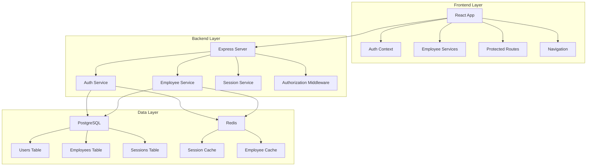
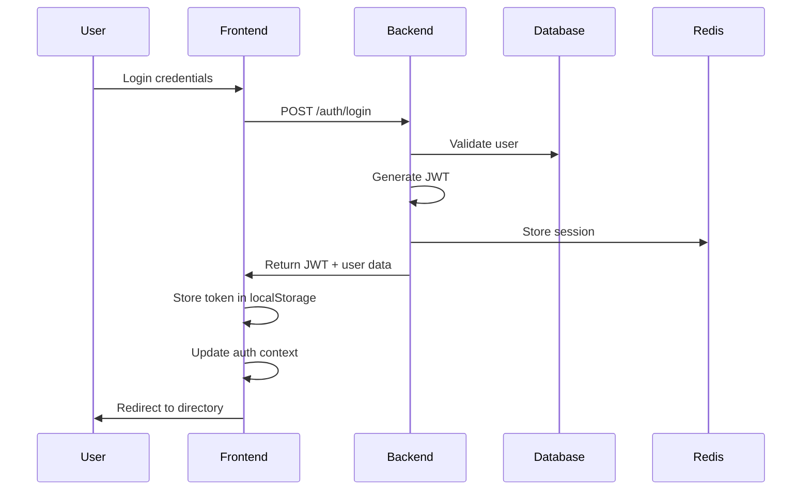

# Design Document: Basic Employee Directory

## Overview

The Basic Employee Directory feature provides essential authentication and employee management functionality by connecting existing backend services to a simplified frontend interface. This design leverages the comprehensive infrastructure already in place (PostgreSQL, Redis, Docker) and the advanced backend services (authentication, employee management, search) while creating a streamlined user experience focused on core functionality.

The system follows a three-tier architecture with a React frontend, Express.js backend, and PostgreSQL database, enhanced with Redis caching for performance. The design emphasizes security through JWT-based authentication, role-based access control, and comprehensive audit logging.

## Architecture

### System Components



### Authentication Flow



## Components and Interfaces

### Frontend Components

#### Authentication Components
- **LoginPage**: Handles user login with email/password
- **AuthContext**: Manages authentication state and token storage
- **ProtectedRoute**: Wraps routes requiring authentication

#### Directory Components
- **EmployeeDirectoryPage**: Main listing of all employees
- **EmployeeCard**: Individual employee display component
- **EmployeeProfilePage**: Detailed employee profile view
- **EmployeeEditPage**: Profile editing interface

#### Navigation Components
- **Navigation**: Main navigation menu with role-based visibility
- **MainLayout**: Overall application layout wrapper
- **Header**: Application header with user info and logout

#### Admin Components
- **AdminEmployeeManagementPage**: Employee CRUD operations for admins
- **AdminDashboardPage**: Basic analytics and system overview

### Backend Services

#### AuthService
```typescript
interface AuthService {
  generateToken(userId: string, tenantId: string, email: string, role: string): string
  validateToken(token: string): JWTPayload
  createSession(userId: string, token: string): Promise<void>
  validateSession(token: string): Promise<boolean>
  invalidateSession(token: string): Promise<void>
  getUserById(userId: string): Promise<AuthenticatedUser | null>
}
```

#### EmployeeService
```typescript
interface EmployeeService {
  listEmployees(filters: EmployeeFilters, pagination: PaginationOptions, context: EmployeeServiceContext): Promise<EmployeeListResult>
  getEmployeeById(employeeId: string, context: EmployeeServiceContext): Promise<Employee>
  updateEmployee(employeeId: string, data: UpdateEmployeeData, context: EmployeeServiceContext): Promise<Employee>
  createEmployee(data: CreateEmployeeData, context: EmployeeServiceContext): Promise<Employee>
  deactivateEmployee(employeeId: string, context: EmployeeServiceContext): Promise<Employee>
}
```

### API Endpoints

#### Authentication Endpoints
- `POST /auth/login` - User login
- `POST /auth/logout` - User logout
- `GET /auth/validate` - Token validation
- `GET /auth/me` - Current user profile

#### Employee Endpoints
- `GET /employees` - List employees with pagination/filtering
- `GET /employees/:id` - Get employee by ID
- `PUT /employees/:id` - Update employee (self or admin)
- `POST /employees` - Create employee (admin only)
- `DELETE /employees/:id` - Deactivate employee (admin only)

## Data Models

### User Model
```typescript
interface User {
  id: string
  tenantId: string
  email: string
  role: 'user' | 'admin' | 'super_admin'
  isActive: boolean
  createdAt: Date
  updatedAt: Date
  lastLoginAt?: Date
}
```

### Employee Model
```typescript
interface Employee {
  id: string
  tenantId: string
  userId?: string
  firstName: string
  lastName: string
  email: string
  phone?: string
  title?: string
  department?: string
  officeLocation?: string
  managerId?: string
  photoUrl?: string
  bio?: string
  skills?: string[]
  isActive: boolean
  createdAt: Date
  updatedAt: Date
}
```

### Session Model
```typescript
interface Session {
  id: string
  userId: string
  tokenHash: string
  expiresAt: Date
  createdAt: Date
}
```

## Correctness Properties

*A property is a characteristic or behavior that should hold true across all valid executions of a system-essentially, a formal statement about what the system should do. Properties serve as the bridge between human-readable specifications and machine-verifiable correctness guarantees.*

### Property 1: Valid Authentication Success
*For any* valid user credentials, authentication should succeed and return a JWT token with correct user information
**Validates: Requirements 1.1**

### Property 2: Invalid Authentication Rejection  
*For any* invalid user credentials (wrong password, non-existent email, malformed input), authentication should be rejected with appropriate error messages
**Validates: Requirements 1.2**

### Property 3: Logout Token Invalidation
*For any* authenticated user session, logging out should invalidate the JWT token and prevent further authenticated requests
**Validates: Requirements 1.3**

### Property 4: Expired Token Rejection
*For any* expired JWT token, requests using that token should be rejected and require re-authentication
**Validates: Requirements 1.4**

### Property 5: Secure Token Storage
*For any* successful authentication, JWT tokens should be stored securely in browser localStorage (not in cookies or sessionStorage)
**Validates: Requirements 1.5**

### Property 6: Complete Directory Listing
*For any* set of active employees in the system, the directory should display all employees with their name, title, department, and contact information visible
**Validates: Requirements 2.1, 2.2**

### Property 7: Directory Pagination
*For any* directory with more than the page size limit of employees, pagination controls should be provided and functional
**Validates: Requirements 2.3**

### Property 8: Data Consistency After Updates
*For any* employee profile update, the changes should be immediately reflected in all views (directory listing, profile page, search results)
**Validates: Requirements 2.4, 7.4**

### Property 9: Complete Profile Display
*For any* employee profile accessed from the directory, all available employee information should be displayed including photo, contact details, and role information
**Validates: Requirements 3.1, 3.2**

### Property 10: Profile Not Found Error Handling
*For any* request for a non-existent employee ID, the system should display an appropriate "employee not found" error message
**Validates: Requirements 3.3**

### Property 11: Profile Navigation
*For any* employee profile page, navigation back to the directory should be available and functional
**Validates: Requirements 3.5**

### Property 12: Self-Edit Permission
*For any* authenticated user, they should be able to edit their own profile but not other users' profiles (unless they are admin)
**Validates: Requirements 4.1, 4.5**

### Property 13: Profile Update Validation
*For any* profile update attempt, invalid data should be rejected with validation errors while valid data should be saved successfully
**Validates: Requirements 4.2, 4.3, 4.4**

### Property 14: Admin Access Control
*For any* user with admin role, they should have access to administrative interfaces and be able to edit any employee profile, while non-admin users should not have these capabilities
**Validates: Requirements 5.1, 5.2, 5.5**

### Property 15: Admin Employee Management
*For any* admin user, they should be able to create new employee profiles and deactivate existing ones with proper validation and confirmation
**Validates: Requirements 5.3, 5.4**

### Property 16: Navigation Consistency
*For any* page in the application, the navigation menu should be present with clear indicators of the current page location
**Validates: Requirements 6.1, 6.4**

### Property 17: Protected Route Authentication
*For any* protected route access attempt without valid authentication, the user should be redirected to the login page
**Validates: Requirements 6.2**

### Property 18: Session Persistence
*For any* authenticated user navigating between pages, their authentication state should be maintained throughout the session
**Validates: Requirements 6.3**

### Property 19: Navigation Error Handling
*For any* navigation failure or error, appropriate error messages and recovery options should be displayed to the user
**Validates: Requirements 6.5**

### Property 20: Database Connectivity
*For any* employee data operation, the system should successfully connect to and interact with the PostgreSQL database
**Validates: Requirements 7.1**

### Property 21: Redis Session Management
*For any* authentication session, session data should be stored in and retrieved from Redis cache
**Validates: Requirements 7.2**

### Property 22: Network Error Handling
*For any* API request that encounters network errors, the system should handle the error gracefully and provide user feedback
**Validates: Requirements 7.3**

### Property 23: Backend Unavailability Handling
*For any* situation where the backend is unavailable, the frontend should display appropriate error messages to users
**Validates: Requirements 7.5**

## Error Handling

### Authentication Errors
- **Invalid Credentials**: Display clear error messages for wrong email/password combinations
- **Token Expiration**: Automatically redirect to login when tokens expire
- **Session Timeout**: Handle Redis session expiration gracefully
- **Network Failures**: Retry authentication requests with exponential backoff

### Data Access Errors
- **Employee Not Found**: Show user-friendly 404 messages for missing employee profiles
- **Permission Denied**: Display appropriate access denied messages for unauthorized actions
- **Validation Errors**: Provide specific field-level validation feedback for form submissions
- **Database Connectivity**: Handle database connection failures with retry logic

### UI Error States
- **Loading States**: Show loading spinners during data fetches
- **Empty States**: Display helpful messages when no employees are found
- **Network Offline**: Detect and handle offline scenarios
- **Component Errors**: Use React error boundaries to catch and display component errors

## Testing Strategy

### Dual Testing Approach
The testing strategy employs both unit testing and property-based testing to ensure comprehensive coverage:

- **Unit Tests**: Focus on specific examples, edge cases, and integration points between components
- **Property Tests**: Verify universal properties across all inputs through randomized testing
- Both approaches are complementary and necessary for complete validation

### Unit Testing Focus Areas
- Specific authentication scenarios (valid login, invalid credentials, logout flow)
- Component rendering with known data sets
- API integration points and error responses
- Edge cases like empty employee lists or missing profile data
- User interaction flows (navigation, form submission, modal interactions)

### Property-Based Testing Configuration
- **Testing Library**: Use `@fast-check/jest` for JavaScript/TypeScript property-based testing
- **Test Iterations**: Minimum 100 iterations per property test to ensure thorough coverage
- **Test Tagging**: Each property test references its corresponding design document property
- **Tag Format**: `Feature: basic-employee-directory, Property {number}: {property_text}`

### Property Test Implementation
Each correctness property must be implemented as a single property-based test:

1. **Authentication Properties**: Generate random valid/invalid credentials and verify authentication behavior
2. **Directory Properties**: Generate random employee datasets and verify listing/display behavior  
3. **Profile Properties**: Generate random employee profiles and verify CRUD operations
4. **Permission Properties**: Generate random user roles and verify access control behavior
5. **Navigation Properties**: Generate random navigation scenarios and verify routing behavior
6. **Error Handling Properties**: Generate random error conditions and verify graceful handling

### Integration Testing
- **API Integration**: Test frontend-backend communication with real API calls
- **Database Integration**: Verify data persistence and retrieval operations
- **Authentication Flow**: Test complete login/logout/session management cycles
- **Role-Based Access**: Verify admin vs user permission enforcement

### Performance Testing
- **Directory Loading**: Verify directory loads within 2 seconds for up to 1000 employees
- **Search Response**: Ensure search results return within 500ms
- **Profile Navigation**: Verify profile pages load within 1 second
- **Concurrent Users**: Test system behavior with multiple simultaneous users

The testing strategy ensures that both specific scenarios work correctly (unit tests) and that the system behaves properly across all possible inputs (property tests), providing confidence in the system's correctness and reliability.